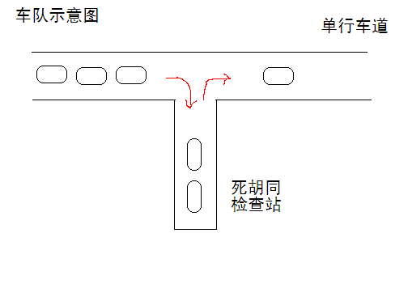

# 20180525练习   

D：第一题 31    打印数字    5min  11:12

```
打印数字

小明写了一个有趣的程序，给定一串数字。
它可以输出这串数字拼出放大的自己的样子。

比如“2016”会输出为：
 22222   00000       1   6666
2     2 0     0    1 1  6
      2 0     0      1  666666
     2  0     0      1  6     6
   2    0     0      1  6     6
 2    2 0     0      1  6     6
2222222  00000     1111  66666

请仔细分析代码，填写划线部分缺少的内容。


public class Main
{
	static void f(int n)
	{
		String[][] di = 
	{{" 00000 ",
	"0     0",
	"0     0",
	"0     0",
	"0     0",
	"0     0",
	" 00000 "},
	{"     1 ",
	"   1 1 ",
	"     1 ",
	"     1 ",
	"     1 ",
	"     1 ",
	"   1111"},
	{" 22222 ",
	"2     2",
	"      2",
	"     2 ",
	"   2   ",
	" 2    2",
	"2222222"},
	{" 33333 ",
	"3     3",
	"      3",
	"  3333 ",
	"      3",
	"3     3",
	" 33333 "},
	{"   44  ",
	"  4 4  ",
	" 4  4  ",
	"4   4  ",
	"4   4  ",
	"4444444",
	"    4  "},
	{" 55555 ",
	" 5     ",
	"555555 ",
	"      5",
	"      5",
	"5     5",
	" 55555 "},
	{" 6666  ",
	"6      ",
	"666666 ",
	"6     6",
	"6     6",
	"6     6",
	" 66666 "},
	{"7777777",
	"7    7 ",
	"    7  ",
	"   7   ",
	"  7    ",
	" 7     ",
	" 7     "},
	{" 88888 ",
	"8     8",
	"8     8",
	" 88888 ",
	"8     8",
	"8     8",
	" 88888 "},
	{" 99999 ",
	"9     9",
	"9     9",
	" 999999",
	"      9",
	"9     9",
	" 99999 "}};
		               
		char[] cc = (""+n).toCharArray(); 
		          
		for(int i=0; i<di[0].length; i++){
			for(int j=0; j<cc.length; j++){
				System.out.print( ____________________ + " ");  //填空位置
			}
			System.out.println();
		}	
	}
	
	public static void main(String[] args)
	{
		f(2016);
	}
}

注意：只提交划线部分缺少的代码，不要添加任何题面已有代码或符号。
也不要提交任何说明解释文字等。
```

M：答案``System.out.print(di[Integer.parseInt(cc[j]+"")][i] + " ");  //填空位置``   

做不出，根据二位数组的形式可以发现。第一个为数字内容，第二个为固定的行。

Z：[31打印数字]

D：第二题 40 危险系数 25min 11:25

Z：[31打印数字 40危险系数]

D：第三题 11 冰雹数 15min 11:31

```
冰雹数

任意给定一个正整数N，
如果是偶数，执行： N / 2
如果是奇数，执行： N * 3 + 1

生成的新的数字再执行同样的动作，循环往复。

通过观察发现，这个数字会一会儿上升到很高，
一会儿又降落下来。
就这样起起落落的，但最终必会落到“1”
这有点像小冰雹粒子在冰雹云中翻滚增长的样子。

比如N=9
9,28,14,7,22,11,34,17,52,26,13,40,20,10,5,16,8,4,2,1
可以看到，N=9的时候，这个“小冰雹”最高冲到了52这个高度。

输入格式：
一个正整数N（N<1000000）
输出格式：
一个正整数，表示不大于N的数字，经过冰雹数变换过程中，最高冲到了多少。

例如，输入：
10
程序应该输出：
52

再例如，输入：
100
程序应该输出：
9232

资源约定：
峰值内存消耗（含虚拟机） < 256M
CPU消耗  < 1000ms
```

M：答案如下  11:38    8min

```java
import java.util.Scanner;

public class Main{
	public static void main(String[] args) {
		Scanner input = new Scanner(System.in);
		int num = input.nextInt();
		System.out.println(run(num));
		
	}

	private static int run(int num) {
		int max = -1;
		for (int i = 1; i <= num; i++) {
			int result = getMax(i);
			if(result > max){
				max = result;
			}
		}
		return max;
	}

	private static int getMax(int num) {
		int max = -1;
		while(num > 1){
			if(num % 2 == 0){
				num = num / 2;
			}else{
				num = num * 3 + 1;
			}
			if(num > max){
				max = num;
			}
		}
		return max;
	}	
}
```

D：第四题   15  平方末尾 10min 11:41  已做过

D：第五题  25 出栈次序  10min  11:43

```
X星球特别讲究秩序，所有道路都是单行线。
一个甲壳虫车队，共16辆车，按照编号先后发车，夹在其它车流中，缓缓前行。

路边有个死胡同，只能容一辆车通过，是临时的检查站，如图所示。
X星球太死板，要求每辆路过的车必须进入检查站，也可能不检查就放行，也可能仔细检查。
如果车辆进入检查站和离开的次序可以任意交错。那么，该车队再次上路后，可能的次序有多少种？

为了方便起见，假设检查站可容纳任意数量的汽车。
显然，如果车队只有1辆车，可能次序1种；2辆车可能次序2种；3辆车可能次序5种。
```

   

M：规定时间内完成

```java

public class Main{
	public static void main(String[] args) {
		System.out.println(run(16,0));	
	}

	private static int run(int inNum,int atNum) {
		if(inNum == 0){
			return 1;
		}
		if(atNum == 0){
			return run(inNum-1, atNum+1);
		}
		return run(inNum-1, atNum+1) + run(inNum, atNum-1) ;
	}
}
```

题目出错，当里面没有车的时候，从外面进入atNum应该+1

```java
		if(atNum == 0){
			return run(inNum-1, atNum+1);
		}
```

[31打印数字 40危险系数 25出栈次序]

D：第六题 15 平方末尾 10min  12:03 已做过

D：第七题 37 稍大的串 25min 12:05

```
标题：稍大的串

  串可以按照字典序进行比较。例如：
  abcd 小于 abdc

  如果给定一个串，打乱组成它的字母，重新排列，可以得到许多不同的串，在这些不同的串中，有一个串刚好给定的串稍微大一些。科学地说：它是大于已知串的所有串中最小的串。你的任务就是求出这个“稍大的串”。

例如：
输入串：
abfxy
程序应该输出：
abfyx

再例如：
输入串：
ayyyxxff
程序应该输出：
fafxxyyy

数据规模约定：
  输入的串不超过1000个字符。

特例：
  如果已知的串已经是所有重组串中最大的，则原样输出读入的那个串。


资源约定：
峰值内存消耗（含虚拟机） < 256M
CPU消耗  < 1000ms


请严格按要求输出，不要画蛇添足地打印类似：“请您输入...” 的多余内容。

所有代码放在同一个源文件中，调试通过后，拷贝提交该源码。
注意：不要使用package语句。不要使用jdk1.7及以上版本的特性。
注意：主类的名字必须是：Main，否则按无效代码处理。
```

M：12:34才完成   并且第一个交换的为较小的数

```java
import java.util.Scanner;

public class Main{
	private static int maxPoint = 0;
	private static int minPoint = 0;
	private static char[] arr = null;
	public static void main(String[] args) {
		Scanner input = new Scanner(System.in);
		String str = input.next();
		arr = str.toCharArray();
		System.out.println(run());
		
	}

	private static String run() {
		findTwoNum();
		changeOne();
		changeAll();
		
		return new String(arr);
	}

	private static void changeAll() {
		int start = maxPoint;
		int end = arr.length-1;
		while(start < end){
			char temp = arr[start];
			arr[start] = arr[end];
			arr[end] = temp;
			start++;
			end--;
		}
	}

	private static void changeOne() {
		for (int i = arr.length-1; i > 0 ; i--) {
			if(arr[i] > arr[minPoint]){
				char temp = arr[i];
				arr[i] = arr[minPoint];
				arr[minPoint] = temp;
				break;
			}
		}
		
	}

	private static void findTwoNum() {
		for (int i = arr.length-1; i > 0 ; i--) {
			if(arr[i] > arr[i-1]){
				maxPoint = i;
				minPoint = i-1;
				break;
			}
		}
	}
}
```

Z：完成失败，[31打印数字 40危险系数 25出栈次序 37稍大的串]   

D：第八题  1 油田 25min 13:17

```
1.油田
输入一个m行n列的字符矩阵，统计字符“@”组成多少个八连快。如果两个字符“@”所在的格子相邻（横、竖或者对角线方向），就说它们属于同一个八连块。例如，下图有两个八连块。
5 5
****@
*@@*@
*@**@
@@@*@
@@**@
```

M：题目解决过程出错

```java
import java.util.Scanner;

public class Main{
	private static int m = 0;
	private static int n = 0;
	private static int[][] idx = null;
	private static char[][] pic = null;
	public static void main(String[] args) {
		Scanner input = new Scanner(System.in);
		m = input.nextInt();
		n = input.nextInt();
		idx = new int[m][n];
		pic = new char[m][n];
		for (int i = 0; i < m; i++) {
			String inStr = input.next();
			for (int j = 0; j < n; j++) {
				pic[i][j] = inStr.charAt(j);
			}
		}
		System.out.println(run());
	}
	private static int run() {
		int count = 0;
		for (int i = 0; i < pic.length; i++) {
			for (int j = 0; j < pic[i].length; j++) {
				if(pic[i][j] == '*' || idx[i][j] != 0){
					continue;
				}
				count++;
				fillIdx(i,j,1);   //标记从1开始
			}
		}
		return count;
	}
	private static void fillIdx(int i, int j, int k) {
		if(i >= m || i < 0 || j >= n || j < 0){
			return;
		}
		
		if(pic[i][j] != '@' || idx[i][j] != 0){
			return;
		}
		idx[i][j] = k;    //需要添加标记
		for (int dr = -1; dr <= 1; dr++) {
			for (int dc = -1; dc <= 1; dc++) {
				if(dr != 0 || dc != 0){
					fillIdx(i + dr, j + dc, k);
				}
			}
		}
				
	}
}
```

- 步伐不能使用x++的方式，否则会控制不住不断走进死胡同。

  而是应该每个方向只试探一步，走完这一步，就是下一方法的事情了。

- 递归的时候记得添加标记，防止多次重复

- 标记从1开始，否则判断标记的方法会导致程序出错。

Z：题目不通过，[31打印数字 40危险系数 25出栈次序 37稍大的串 1油田]   

D：第九题  3 路径之谜 20min 14:10

```    
路径之谜

小明冒充X星球的骑士，进入了一个奇怪的城堡。
城堡里边什么都没有，只有方形石头铺成的地面。

假设城堡地面是 n x n 个方格。【如图1.png】所示。

按习俗，骑士要从西北角走到东南角。
可以横向或纵向移动，但不能斜着走，也不能跳跃。
每走到一个新方格，就要向正北方和正西方各射一箭。
（城堡的西墙和北墙内各有 n 个靶子）


同一个方格只允许经过一次。但不必做完所有的方格。

如果只给出靶子上箭的数目，你能推断出骑士的行走路线吗？

有时是可以的，比如图1.png中的例子。

本题的要求就是已知箭靶数字，求骑士的行走路径（测试数据保证路径唯一）

输入：
第一行一个整数N(0<N<20)，表示地面有 N x N 个方格
第二行N个整数，空格分开，表示北边的箭靶上的数字（自西向东）
第三行N个整数，空格分开，表示西边的箭靶上的数字（自北向南）

输出：
一行若干个整数，表示骑士路径。

为了方便表示，我们约定每个小格子用一个数字代表，从西北角开始编号: 0,1,2,3....
比如，图1.png中的方块编号为：

0  1  2  3
4  5  6  7
8  9  10 11
12 13 14 15


示例：
用户输入：
4
2 4 3 4
4 3 3 3

程序应该输出：
0 4 5 1 2 3 7 11 10 9 13 14 15


资源约定：
峰值内存消耗 < 256M
CPU消耗  < 1000ms


请严格按要求输出，不要画蛇添足地打印类似：“请您输入...” 的多余内容。

所有代码放在同一个源文件中，调试通过后，拷贝提交该源码。
注意：不要使用package语句。不要使用jdk1.7及以上版本的特性。
注意：主类的名字必须是：Main，否则按无效代码处理。
```

M：解决了很久还没做好，并且这道题是很重要的，学习了一下之前的做法

```java
import java.util.Arrays;  
import java.util.Scanner;  
  
public class Main {  
    static int N;    
    static int []north;//正北方靶数    
    static int []west;//正西方靶数    
    static int[][]direction={{0,-1},{0,1},{-1,0},{1,0}};//上下左右移动方向    
    static int[][]mark;//用来标记是否经过某块石头，0为未经过，1为经过    
    static int x,y;//石头坐标，正东方向为x轴正方向，正南方向为y轴正方向    
    public static void main(String[] args) {  
        // TODO Auto-generated method stub  
        Scanner input = new Scanner(System.in);  
        //地面有N*N个方格  
        N = input.nextInt();  
        //北边以及西边箭靶上的数字  
        north = new int[N];  
        west = new int[N];
        mark = new int[N][N];  
        for(int i = 0; i < N;i++){  
            north[i] = input.nextInt();  
        }  
        for(int i = 0; i < N; i++){  
            west[i] = input.nextInt();  
        }
        mark[0][0]=1;   //默认第一个标记
        dfs("0");  
    }  
      
    public static void dfs(String s){  
    	if(x>=N-1 && y>=N-1){  
    		if(canEqual()){
    			System.out.println(s);
    		}
        }  
          
        //朝四个方向走  
        for(int i = 0; i < 4; i++){  
        	x += direction[i][0];  
        	y += direction[i][1];  
            if(x >= 0 && y >= 0 && x < N && y < N && mark[x][y] == 0){   //筛选不符合情况  
            	int position = x + N * y;    //所在位置编号  
            	String str = s + " "+ position;  
                mark[x][y]=1;  //标记
                dfs(str);  
                mark[x][y]=0;//数组回溯  
            }  
            x -= direction[i][0];  
            y-= direction[i][1];    //全局回溯  
        }  
    }

    private static boolean canEqual() {
		int[] north_count = new int[N];  
		int[] west_count = new int[N];  
		for(int i = 0; i < N;i++){  
		    for(int j = 0; j < N; j++){  
		        north_count[i] += mark[i][j];//每列靶子上的箭数  
		        west_count[i] += mark[j][i];//每行靶子上的箭数  
		    }  
		}  
		if(Arrays.equals(north, north_count)&&Arrays.equals(west, west_count)){  
		    return true;  
		}
		return false;
	}  
  
}  
```

主要是参数的控制，str为结果，作为参数不用回溯。check和x,y为全局，需要进行回溯。

Z：[3路径之谜 31打印数字 40危险系数 25出栈次序 37稍大的串 1油田]   

D：第十题  26 小计算器 20min 17:27

``` 
标题：小计算器

模拟程序型计算器，依次输入指令，可能包含的指令有

1. 数字：'NUM X'，X为一个只包含大写字母和数字的字符串，表示一个当前进制的数
2. 运算指令：'ADD','SUB','MUL','DIV','MOD'，分别表示加减乘，除法取商，除法取余
3. 进制转换指令：'CHANGE K'，将当前进制转换为K进制(2≤K≤36)
4. 输出指令：'EQUAL'，以当前进制输出结果
5. 重置指令：'CLEAR'，清除当前数字

指令按照以下规则给出：
数字，运算指令不会连续给出，进制转换指令，输出指令，重置指令有可能连续给出
运算指令后出现的第一个数字，表示参与运算的数字。且在该运算指令和该数字中间不会出现运算指令和输出指令
重置指令后出现的第一个数字，表示基础值。且在重置指令和第一个数字中间不会出现运算指令和输出指令
进制转换指令可能出现在任何地方

运算过程中中间变量均为非负整数，且小于2^63。
以大写的'A'~'Z'表示10~35

[输入格式]
第1行：1个n，表示指令数量
第2..n+1行：每行给出一条指令。指令序列一定以'CLEAR'作为开始，并且满足指令规则

[输出格式]
依次给出每一次'EQUAL'得到的结果

[样例输入]
7
CLEAR
NUM 1024
CHANGE 2
ADD
NUM 100000
CHANGE 8
EQUAL

[样例输出]
2040

资源约定：
峰值内存消耗 < 256M
CPU消耗  < 1000ms

请严格按要求输出，不要画蛇添足地打印类似：“请您输入...” 的多余内容。

所有代码放在同一个源文件中，调试通过后，拷贝提交该源码。
注意：不要使用package语句。不要使用jdk1.7及以上版本的特性。
注意：主类的名字必须是：Main，否则按无效代码处理。
```

Z：


