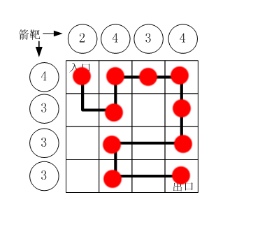

# 路径之谜   

D：来一道通用的题目，路径行走

```
路径之谜

小明冒充X星球的骑士，进入了一个奇怪的城堡。
城堡里边什么都没有，只有方形石头铺成的地面。

假设城堡地面是 n x n 个方格。【如图1.png】所示。

按习俗，骑士要从西北角走到东南角。
可以横向或纵向移动，但不能斜着走，也不能跳跃。
每走到一个新方格，就要向正北方和正西方各射一箭。
（城堡的西墙和北墙内各有 n 个靶子）


同一个方格只允许经过一次。但不必做完所有的方格。

如果只给出靶子上箭的数目，你能推断出骑士的行走路线吗？

有时是可以的，比如图1.png中的例子。

本题的要求就是已知箭靶数字，求骑士的行走路径（测试数据保证路径唯一）

输入：
第一行一个整数N(0<N<20)，表示地面有 N x N 个方格
第二行N个整数，空格分开，表示北边的箭靶上的数字（自西向东）
第三行N个整数，空格分开，表示西边的箭靶上的数字（自北向南）

输出：
一行若干个整数，表示骑士路径。

为了方便表示，我们约定每个小格子用一个数字代表，从西北角开始编号: 0,1,2,3....
比如，图1.png中的方块编号为：

0  1  2  3
4  5  6  7
8  9  10 11
12 13 14 15


示例：
用户输入：
4
2 4 3 4
4 3 3 3

程序应该输出：
0 4 5 1 2 3 7 11 10 9 13 14 15


资源约定：
峰值内存消耗 < 256M
CPU消耗  < 1000ms


请严格按要求输出，不要画蛇添足地打印类似：“请您输入...” 的多余内容。

所有代码放在同一个源文件中，调试通过后，拷贝提交该源码。
注意：不要使用package语句。不要使用jdk1.7及以上版本的特性。
注意：主类的名字必须是：Main，否则按无效代码处理。
```


M：抛开程序，格子的路线确定我能想到的需要以下步骤：

1. 填充格子：将确定四格的进行填充
2. 然后通过数量之间的互相约束，确定其他点的所在位置

       

怎么用程序表达其相互约束的关系呢？

Z：看一下网友的解法    [链接](https://blog.csdn.net/qq_36271570/article/details/71582535)  

```java
import java.util.Arrays;  
import java.util.Scanner;  
  
public class Test3 {  
    static int N;    
    static int []north;//正北方靶数    
    static int []west;//正西方靶数    
    static int[][]direction={{0,-1},{0,1},{-1,0},{1,0}};//上下左右移动方向    
    static int[][]mark;//用来标记是否经过某块石头，0为未经过，1为经过    
    static int x,y;//石头坐标，正东方向为x轴正方向，正南方向为y轴正方向    
    public static void main(String[] args) {  
        // TODO Auto-generated method stub  
        Scanner console = new Scanner(System.in);  
        //地面有N*N个方格  
        N = console.nextInt();  
        //北边以及西边箭靶上的数字  
        north = new int[N];  
        west = new int[N];
        mark = new int[N][N];  
        for(int i = 0; i < N;i++){  
            north[i] = console.nextInt();  
        }  
        for(int i = 0; i < N; i++){  
            west[i] = console.nextInt();  
        }  
        mark[0][0]=1;  
        dfs("0");  
    }  
      
    public static void dfs(String s){  
        if(x>=N-1&&y>=N-1){  
            int[] north_count = new int[N];  
            int[] west_count = new int[N];  
            for(int i = 0; i < N;i++){  
                for(int j = 0; j < N; j++){  
                    north_count[i] += mark[i][j];//每列靶子上的箭数  
                    west_count[i] += mark[j][i];//每行靶子上的箭数  
                }  
            }  
            if(Arrays.equals(north, north_count)&&Arrays.equals(west, west_count)){  
                System.out.println(s);  
                return;  
            }  
        }  
          
        //朝四个方向走  
        for(int i = 0; i < 4; i++){  
            x += direction[i][0];  
            y += direction[i][1];  
            int position;  
            position = x+N*y;//石头编号  
            String str = s + " "+position;  
            if(x>=0 && y>=0 && x<N && y<N &&mark[x][y]==0){  
                mark[x][y]=1;  
                dfs(str);  
                mark[x][y]=0;//回溯  
            }  
            x -= direction[i][0];  
            y-= direction[i][1];//回溯  
        }  
    }  
  
}  
```

网友根本就不需要先填充再分析。而是直接遍历所有的深度路径，将符合的输出即可。

M：用什么作为遍历的主线呢？怎么想到的？

Z：首先观察输出的结果，要的是表示路线的字符串。而这个表示路线的字符串就可以由递归构建而成。

M：那怎么构建通用等式呢？

Z：已知起点，终点位置，行走方式。它的通用行为就是往某一方向行走下一步。

```java
        //朝四个方向走  
        for(int i = 0; i < 4; i++){  
            x += direction[i][0];  
            y += direction[i][1];  
            int position;  
            position = x+N*y;//石头编号  
            String str = s + " "+position;  
            if(x>=0 && y>=0 && x<N && y<N &&mark[x][y]==0){  
                mark[x][y]=1;  
                dfs(str);  
                mark[x][y]=0;//回溯  
            }  
            x -= direction[i][0];  
            y-= direction[i][1];//回溯  
        }  
```

由于每个格子只能被行走一次，所以需要用到标记数组。x，y代表当前的位置，循环四个方向向所有步骤试探回溯。

行走的时候注意对边界的限制，否则容易走出界``x>=0 && y>=0 && x<N && y<N``   

M：那怎么确定出口呢？

Z：不断地行走，总会走进死胡同 / 走到终点。

1. 走到死胡同，就会因为进不了if，最终进行了回溯

```java
            x -= direction[i][0];  
            y-= direction[i][1];//回溯  
```

2. 而走到终点，就需要对结果进行验证

```java
        if(x>=N-1&&y>=N-1){     //位于终点那一个点
            int[] north_count = new int[N];  
            int[] west_count = new int[N];  
            for(int i = 0; i < N;i++){  
                for(int j = 0; j < N; j++){  
                    north_count[i] += mark[i][j];//每列靶子上的箭数  
                    west_count[i] += mark[j][i];//每行靶子上的箭数  
                }  
            }  
            if(Arrays.equals(north, north_count)&&Arrays.equals(west, west_count)){  
                System.out.println(s);  
                return;  
            }  
        }  
```

M：它是怎么收集靶子上的数量的呢？   

Z：横纵靶子就是统计组的方向不同

```java
            for(int i = 0; i < N;i++){  
                for(int j = 0; j < N; j++){  
                    north_count[i] += mark[i][j];//每列靶子上的箭数  
                    west_count[i] += mark[j][i];//每行靶子上的箭数  
                }  
            }  
```

最后对靶子数进行验算即可进行输出

M：总结一下，这是一道行走的深度搜索问题

观察输出的结果为路径的字符串，所以使用字符串作为递归的参数

确定位置坐标xy，对四个不同方向进行试探。

试探的约束条件有，1.总个格子的长度，2.已走过的格子。

试探的结果有两种，1.死胡同 ，2.终点

遇到路径行走的题目，用递归dfs模拟行走。

D：同样类型的题目，解一下之前的[地宫寻宝](treasure.md)   

```
标题：地宫取宝
    X 国王有一个地宫宝库。是 n x m 个格子的矩阵。每个格子放一件宝贝。每个宝贝贴着价值标签。
    地宫的入口在左上角，出口在右下角。
    小明被带到地宫的入口，国王要求他只能向右或向下行走。
    走过某个格子时，如果那个格子中的宝贝价值比小明手中任意宝贝价值都大，小明就可以拿起它（当然，也可以不拿）。
    当小明走到出口时，如果他手中的宝贝恰好是k件，则这些宝贝就可以送给小明。
    请你帮小明算一算，在给定的局面下，他有多少种不同的行动方案能获得这k件宝贝。

【数据格式】
    输入一行3个整数，用空格分开：n m k (1<=n,m<=50, 1<=k<=12)
    接下来有 n 行数据，每行有 m 个整数 Ci (0<=Ci<=12)代表这个格子上的宝物的价值
    要求输出一个整数，表示正好取k个宝贝的行动方案数。该数字可能很大，输出它对 1000000007 取模的结果。

例如，输入：
2 2 2
1 2
2 1
程序应该输出：
2

再例如，输入：
2 3 2
1 2 3
2 1 5
程序应该输出：
14


资源约定：
峰值内存消耗（含虚拟机） < 256M
CPU消耗  < 2000ms
```

M：我解出来之后，得出的答案一直不正确

```java
import java.util.ArrayList;
import java.util.Scanner;

public class Test{
	static int[][] move = {{1,0},{0,1}};
	static int result = 0;   //符合的方案
	//宝物地图
	static int[][] arr = null;
	//当前位置
	static int x = -1;
	static int y = 0;
	//图形的数据
	static int h = 0;
	static int w = 0;
	
	static int maxValue = 0;   //手上最贵的价值
	static int wentNum = 0;   //预期数目
	
	static ArrayList<String> path = new ArrayList<String>();
	
	
	public static void main(String[] args) {
		Scanner input = new Scanner(System.in);
		h = input.nextInt();
		w = input.nextInt();
		wentNum = input.nextInt();   //预期数目
		arr = new int[h][w];
		
		for (int i = 0; i < arr.length; i++) {
			for (int j = 0; j < arr[0].length; j++) {
				arr[i][j] = input.nextInt();
			}
		}
		run(0,path);
		System.out.println(result % 1000000007);
	}

	private static void run(int get,ArrayList<String> path) {   //手中的宝物数
		if(x == w-1 && y == h-1){
			if(get == wentNum){
				result++;
				System.out.println(path.toString());
			}
            //多余代码
			else if(get == wentNum-1 && arr[y][x] > maxValue){
				result++;
				System.out.println(path.toString());
			}
		}
		
		for (int i = 0; i < move.length; i++) {
			x += move[i][0];
			y += move[i][1];
			if(x < w && y < h && x >= 0 && y >= 0){
				//拿
				int temp = maxValue;
				if(arr[y][x] > maxValue){
					maxValue = arr[y][x];
					path.add("【"+x+":"+y+"】");
					run(get + 1,path);
					path.remove(path.size()-1);
				}
				//不拿  & 没法拿
				maxValue = temp;  //回溯
				path.add("("+x+":"+y+")");
				run(get,path);
				path.remove(path.size()-1);
			}
			x -= move[i][0];      //回溯
			y -= move[i][1];
		}
		
	}
}
```

正确答案应该是

```
再例如，输入：
2 3 2
1 2 3
2 1 5
程序应该输出：
14
```

而我的结果总是23

Z：把过程打印出来，分析分析

M：输出的答案是：``【代表取】，(代表不取)``   

```
[【0:0】, 【1:0】, (2:0), (2:1)]
[【0:0】, 【1:0】, (1:1), (2:1)]
[【0:0】, (1:0), 【2:0】, (2:1)]
[【0:0】, (1:0), (2:0), 【2:1】]
[【0:0】, (1:0), (2:0), (2:1)]
[【0:0】, (1:0), (1:1), 【2:1】]
[【0:0】, (1:0), (1:1), (2:1)]
[【0:0】, 【0:1】, (1:1), (2:1)]
[【0:0】, (0:1), (1:1), 【2:1】]
[【0:0】, (0:1), (1:1), (2:1)]
[(0:0), 【1:0】, 【2:0】, (2:1)]
[(0:0), 【1:0】, (2:0), 【2:1】]
[(0:0), 【1:0】, (2:0), (2:1)]
[(0:0), 【1:0】, (1:1), 【2:1】]
[(0:0), 【1:0】, (1:1), (2:1)]
[(0:0), (1:0), 【2:0】, 【2:1】]
[(0:0), (1:0), 【2:0】, (2:1)]
[(0:0), (1:0), 【1:1】, 【2:1】]
[(0:0), (1:0), 【1:1】, (2:1)]
[(0:0), 【0:1】, (1:1), 【2:1】]
[(0:0), 【0:1】, (1:1), (2:1)]
[(0:0), (0:1), 【1:1】, 【2:1】]
[(0:0), (0:1), 【1:1】, (2:1)]
```

Z：经过分析发现，有单个【拿取】的答案

```
[【0:0】, (1:0), (2:0), (2:1)]
```

这来自于出口设置的谨慎

```java
            //多余代码
			else if(get == wentNum-1 && arr[y][x] > maxValue){
				result++;
				System.out.println(path.toString());
			}
```

当它位于最后的位置上，也有可能拿走当前位置的宝物。

可是这就与上边的情况列举重复了

```
[(0:0), 【0:1】, (1:1), 【2:1】]
[(0:0), 【0:1】, (1:1), (2:1)]
```

M：所以总结出原因是：因为我在递归通用式中，就将拿与不拿的情况都考虑进去了。所以最后出口就无需再做判断。

```java
			if(x < w && y < h && x >= 0 && y >= 0){
				//拿
				int temp = maxValue;
				if(arr[y][x] > maxValue){
					maxValue = arr[y][x];
					run(get + 1);
				}
				//不拿  & 没法拿
				maxValue = temp;  //回溯
				run(get);
			}
```

M：修改后代码如下：

```java
import java.util.Scanner;

public class Test{
	static int[][] move = {{1,0},{0,1}};
	static int result = 0;   //符合的方案
	//宝物地图
	static int[][] arr = null;
	//当前位置
	static int x = -1;
	static int y = 0;
	//图形的数据
	static int h = 0;
	static int w = 0;
	
	static int maxValue = 0;   //手上最贵的价值
	static int wentNum = 0;   //预期数目
	
	public static void main(String[] args) {
		Scanner input = new Scanner(System.in);
		h = input.nextInt();
		w = input.nextInt();
		wentNum = input.nextInt();   //预期数目
		arr = new int[h][w];
		
		for (int i = 0; i < arr.length; i++) {
			for (int j = 0; j < arr[0].length; j++) {
				arr[i][j] = input.nextInt();
			}
		}
		run(0);
		System.out.println(result % 1000000007);
	}

	private static void run(int get) {   //手中的宝物数
		if(x == w-1 && y == h-1){
			if(get == wentNum){
				result++;
			}
		}
		
		for (int i = 0; i < move.length; i++) {
			x += move[i][0];
			y += move[i][1];
			if(x < w && y < h && x >= 0 && y >= 0){
				//拿
				int temp = maxValue;
				if(arr[y][x] > maxValue){
					maxValue = arr[y][x];
					run(get + 1);
				}
				//不拿  & 没法拿
				maxValue = temp;  //回溯
				run(get);
			}
			x -= move[i][0];      //回溯
			y -= move[i][1];
		}
		
	}
}
```


