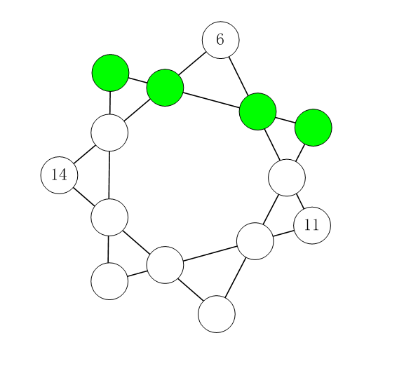
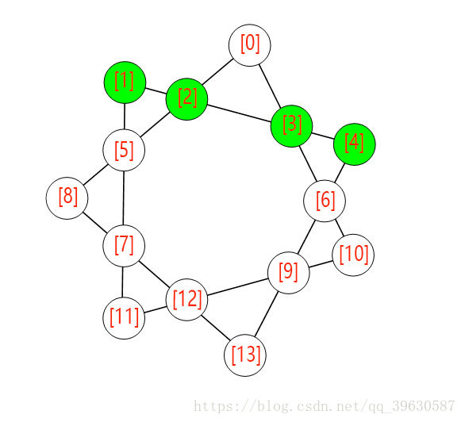

# 七星填数

D：来一道题目，希望对你来说不会太难

```
七星填数

如图【图1.png】所示。

在七角星的14个节点上填入1~14 的数字，不重复，不遗漏。
要求每条直线上的四个数字之和必须相等。

图中已经给出了3个数字。
请计算其它位置要填充的数字，答案唯一。

填好后，请提交绿色节点的4个数字（从左到右，用空格分开）

比如：12 5 4 8
当然，这不是正确的答案。

注意：只提交4个用空格分开的数字，不要填写任何多余的内容。
```

  

Z：这道题可以简单翻译为，14个数字，每个数字出现1次。

它的立体结构可以分为7行，每行4个数字，并且4个数字的值都相等。

已知其中的行：

1，``14，*，*，6``

2，``6,*,*,11``  

3，``11,*,*,*``  

7，``*,*,*,14``  

其中每一行的开头数是上一行的结尾数

而其他数也和其他行有着紧密关联

求第7行的内容为多少？

M：我知道这道题或许可以用暴力破解求出来，但是要怎么表示紧密关联的关系，就像每一行的第二个又是另一行的第二个（串在一起）...怎么表示这种比较复杂的空间结构？

Z：没有思路，看一下网友的解法[链接](https://blog.csdn.net/qq_39630587/article/details/79729481)  

```java
public class Main {
    static int[] a = {1, 2, 3, 4, 5, 7, 8, 9, 10, 12, 13};
    static int [] b;
    static boolean[] c, d;
    public static void main(String[] args) {
        c = new boolean[14];
        d = new boolean[14];
        b = new int[14];

        b[0] = 6;
        b[8] = 14;
        b[10] = 11;
        c[0] = true;
        c[8] = true;
        c[10] = true;

        f(0);
    }
    private static void f(int i) {
        // 剪枝
        if (i == 9) {
            if (b[1] + b[2] + b[3] + b[4] != b[0] + b[2] + b[5] + b[8]) {
                return;
            }
        }
        if (i == 11) {
            if (b[1] + b[2] + b[3] + b[4] != b[0] + b[3] + b[6] + b[10]) {
                return;
            }
        }
        if (i == 12) {
            if (b[1] + b[2] + b[3] + b[4] != b[1] + b[5] + b[7] + b[11]) {
                return;
            }
        }
        if (i == 13) {
            if (b[1] + b[2] + b[3] + b[4] != b[9] + b[10] + b[11] + b[12]) {
                return;
            }
        }
        if (i == 14) {
            if (b[1] + b[2] + b[3] + b[4] != b[7] + b[8] + b[12] + b[13]) {
                return;
            }
            if (b[1] + b[2] + b[3] + b[4] != b[4] + b[6] + b[9] + b[13]) {
                return;
            }
            for (int j = 0; j < c.length; j++) {
                System.out.print(j==0 ? "" : " ");
                System.out.print(b[j]);
            }
            return;
        }
        if (c[i] == false) {
            for (int j = 0; j < a.length; j++) {
                if (d[j] == false) {
                    d[j] = true;
                    c[i] = true;
                    b[i] = a[j];
                    f(i + 1);
                    c[i] = false;
                    d[j] = false;
                }
            }
        } else {
            f(i + 1);
        }
    }
}
```

果然，网友的做法也是对每个位置进行标号，然后暴力破解。结果为：``6 10 3 9``   

    

M：loading