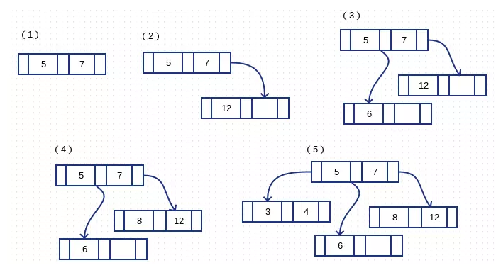

# Tree

## m-way

m-way是一种树形存储结构，如3-way查找树``[5, 7, 12, 6, 8, 3, 4]``

  

- 每个节点可以存储多个key，key的数量最大为m-1(这里是2)

- 每个节点的度 <= m (这里最多3条线)
- 子节点按顺序排序，三种情况：小于、介于、大于

## BTree

Balance Tree，一般用于数据库的索引。B Tree是一种平衡的m-way查找树。利用m-way多分支特性，从而减少查询时所需经历的节点数。

Btree必须采用二分法查找，时间复杂度为O（logn）。

```
下面是往B树中依次插入：6 10 4 14 5 11 15 3 2 12 1 7 8 8 6 3 6 21 5 15 15 6 32 23 45 65 7 8 6 5 4
```

  

一旦插入的节点数超过m-1，则需要对当前节点进行拆分。并入上级节点或者产生下级节点。

## B+Tree

B+Tree时BTree的变体，B+树的非叶子结点只包含导航信息，叶子结点使用链表相连（包含所有数据信息），便于区间查找和遍历。

由于不含数据信息，所以可以存放更多的Key，遍历整棵树仅需一次线性遍历叶子结点即可。而BTree需要每一层递归遍历，数据在内存中不相邻，缓存命中性没有B+Tree好。

    


B+Tree代码研究


