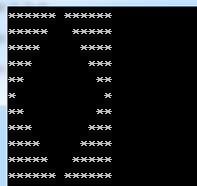

# 空心菱形

D：抽取到的题目

```
标题：空心菱形

小明刚刚开发了一个小程序，可以打印出任意规模的空心菱形，规模为6时，如下图：
****** ******
*****   *****
****     ****
***       ***
**         **
*           *
**         **
***       ***
****     ****
*****   *****
****** ******
（如果有对齐问题，参看【图1.png】）

他一高兴，踢掉了电源，最后一次修改没有保存.....
毛病出在划线的部分。
请你帮助小明分析程序，填写划线部分缺失的代码。

public class Main
{
	static String pr(int m, int n)
	{
		String s = "";
		for(int i=0; i<n; i++) s += " ";
		for(int i=0; i<m; i++) s = "*" + s + "*";
		return s;
	}
	
	static void f(int n)
	{
		String s = pr(1,n*2-1) + "\n";
	    String s2 = s;
	    	
		for(int i=1; i<n; i++){
			s = ____________________________________;  //填空位置
			s2 = s + s2 + s; 
		}
		
		System.out.print(s2);
	}
	
	public static void main(String[] args)
	{
		f(6);
	}
}
```

   

Z：老规矩，将题目搬到IDE上，尝试运行一下。

M：运行到``		for(int i=1; i<n; i++){``的时候，发现s2的值为 ``*           *``,那我s要做什么操作，才能使得

  ``s2 = s + s2 + s;``  得出的结果为 ``****** ******`` ， 怎么大的空格要怎么补全？   

Z：看一下网友是怎么实现的。[链接](https://blog.csdn.net/Divide_/article/details/51459966)   

网友答案``s = pr(i+1, 2*(n-i)-1) + "\n";  // 填空位置`` 。至于怎么实现这种意想不到的效果的呢，看看形成过程就知道了。

```   
**         **
*           *
**         **
---------------------------------
***       ***
**         **
*           *
**         **
***       ***
---------------------------------
****     ****
***       ***
**         **
*           *
**         **
***       ***
****     ****
---------------------------------
*****   *****
****     ****
***       ***
**         **
*           *
**         **
***       ***
****     ****
*****   *****
---------------------------------
****** ******
*****   *****
****     ****
***       ***
**         **
*           *
**         **
***       ***
****     ****
*****   *****
****** ******
```

M：问题就在于循环5次，却有11行，说明每次循环打印的是两行。根据``s2 = s + s2 + s;``推算出是从中间添加起。

而``pr(int m, int n)``方法中，n是空格，m是*的数目。所以``**         **``中，m=i+1，

n为 ``(2 *n+1)-2 *(i+1) ``  演化而来。